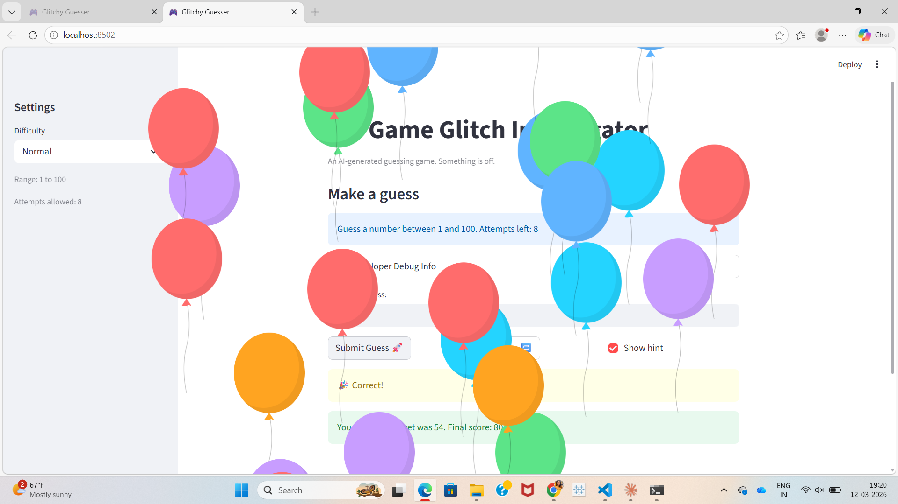
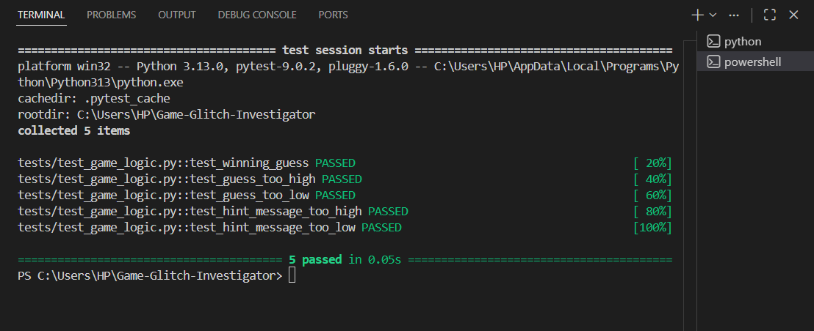
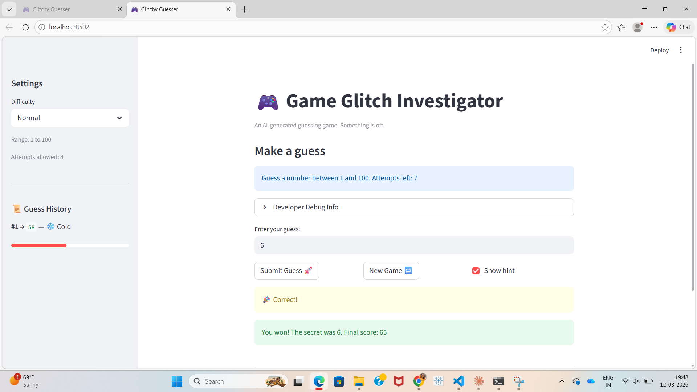

# 🎮 Game Glitch Investigator: The Impossible Guesser

## 🚨 The Situation

You asked an AI to build a simple "Number Guessing Game" using Streamlit.
It wrote the code, ran away, and now the game is unplayable. 

- You can't win.
- The hints lie to you.
- The secret number seems to have commitment issues.

## 🛠️ Setup

1. Install dependencies: `pip install -r requirements.txt`
2. Run the broken app: `python -m streamlit run app.py`

## 🕵️‍♂️ Your Mission

1. **Play the game.** Open the "Developer Debug Info" tab in the app to see the secret number. Try to win.
2. **Find the State Bug.** Why does the secret number change every time you click "Submit"? Ask ChatGPT: *"How do I keep a variable from resetting in Streamlit when I click a button?"*
3. **Fix the Logic.** The hints ("Higher/Lower") are wrong. Fix them.
4. **Refactor & Test.** - Move the logic into `logic_utils.py`.
   - Run `pytest` in your terminal.
   - Keep fixing until all tests pass!

## 📝 Document Your Experience

### 🎯 Game Purpose
This is a number guessing game built with Streamlit. The player selects a difficulty level (Easy: 1–20, Normal: 1–100, Hard: 1–500), then guesses the secret number within a limited number of attempts. Each guess receives a "Too High" or "Too Low" hint to guide the player. The score decreases with each wrong guess and rewards winning sooner.

### 🐛 Bugs Found

| # | Bug | Effect |
|---|-----|--------|
| 1 | Hints were backwards | "Go HIGHER" shown when guess was too high — impossible to converge |
| 2 | Secret cast to string on even attempts | Correct guesses on attempt 2, 4, 6... never registered as a win |
| 3 | Attempts counter started at 1 instead of 0 | "Attempts left" was always one short; score penalised from first guess |
| 4 | Score rewarded wrong guesses on even attempts | Player gained +5 points for a "Too High" guess on even turns |
| 5 | Hard difficulty easier than Normal (range 1–50 vs 1–100) | Selecting "Hard" was actually easier than "Normal" |
| 6 | New Game ignored difficulty setting | Always generated secret between 1–100 regardless of selected difficulty |
| 7 | Info text hardcoded "1 and 100" | Showed wrong range for Easy and Hard difficulties |
| 8 | `logic_utils.py` was all stubs | All functions raised `NotImplementedError`; tests could never pass |
| 9 | Test assertions compared tuple to string | `check_guess` returns `(outcome, message)` but tests checked `result == "Win"` |

### 🔧 Fixes Applied

- **Hints fixed** — swapped messages in `check_guess`: "Too High" → "Go LOWER", "Too Low" → "Go HIGHER"
- **String cast removed** — deleted the `if attempts % 2 == 0: secret = str(secret)` block; secret is always an int
- **Attempts initialised to 0** — changed `st.session_state.attempts = 1` to `= 0`
- **Scoring fixed** — both "Too High" and "Too Low" now always subtract 5 points
- **Hard difficulty fixed** — range changed to 1–500 to be genuinely harder
- **New Game fixed** — uses `random.randint(low, high)` based on selected difficulty
- **Info text fixed** — now shows `{low} and {high}` dynamically
- **Refactored into `logic_utils.py`** — all four logic functions moved out of `app.py`
- **Test assertions fixed** — unpacked tuple with `outcome, message = check_guess(...)` and asserted on `outcome`

## 📸 Demo

### Winning Game

### pytest Results (5 passed)

## 🚀 Stretch Features

### Challenge 2: Guess History Sidebar
Added a **Guess History** panel in the sidebar that shows each past guess with a hot/cold temperature indicator (🔥 Burning hot → 🧊 Ice cold) and a progress bar showing how close the guess was to the secret number.

